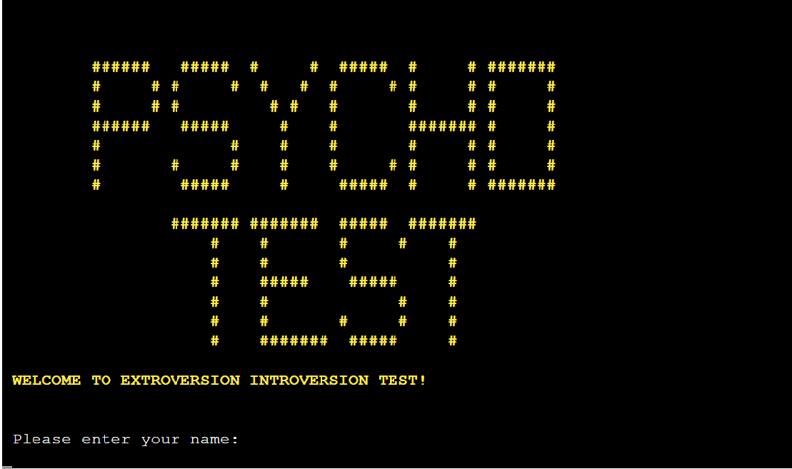

# Extroversion Introversion Test 

### [Live site](https://extro-intro-test.herokuapp.com/)

## Contents:

- <a href="#introduction">Introduction</a>
- <a href="#flow">Flowchart</a>
- <a href="#experience">User Experience Design</a>
- <a href="#features">Features</a>

## 
Introduction

The Extroversion-Introversion test is a psychological assessment tool designed to measure an individual's personality traits related to extroversion and introversion. Extroversion and introversion are fundamental dimensions of personality proposed by Swiss psychologist Carl Jung.

Extroversion refers to a person's tendency to seek external stimulation and derive energy from social interactions. Extroverts are often outgoing, assertive, and enjoy being around people. They tend to be talkative, energetic, and may exhibit a preference for engaging in activities involving others.

Introversion, on the other hand, reflects a preference for internal reflection and solitude. Introverts tend to be more reserved, thoughtful, and prefer quiet environments. They may feel drained by excessive social interactions and require alone time to recharge their energy.

Ambiversion refers to a psychological concept that describes individuals who exhibit a balance between extroversion and introversion. An ambivert is someone who does not strongly lean towards either extreme of the extroversion-introversion spectrum but rather falls somewhere in the middle.

Unlike strict extroverts or introverts who lean heavily towards one end of the spectrum, ambiverts can adapt their behavior and energy levels to different social settings. They may enjoy and feel energized by social interactions, but also value and seek out periods of solitude and reflection.

This very simple test will allow the user to check whether he is an extrovert, an introvert or, like most people, an ambivert.

## 
Flowchart

The below flowchart shows the order in which actions are taken and how the program works.

## 
User Experience Design

### First Time User

- As a person who like likes to take tests, I would like some test with psychological questions but not too  long and difficult.
- As someone unfamiliar with the psychology, I would like something new and interesting  to pick up.
- As someone who is well-versed in psychology, I would like to compare this test with other tests I know to form my opinion.

### Returning User

- As a returning user, I would like to see my most recent result.
- I would like to be able to take the test again and compare the results. 
- I wish the questions were different every time I take the test.

## 
Features

### Introductory message

When the user runs the system, they will be greeted with a logo and a welcome message.

### Data Validation
The user is asked to enter their name and email. The data will only be classified as valid if the name contains at least 2 letters and the email address is in the correct format.
The data is validated, and it is checked whether the user exists in the database.
For the new user, a description of the test is displayed. For the returning user, the program shows the most recent result and asks if they want to take the test again. 

### Passing the test
There are 3 groups of questions in the database: general questions, specific questions to determine introversion, and specific questions to determine extroversion. 
The test begins with a general group of questions.
For each answer in the direction of extroversion the user receives 1 point, in the direction of introversion the user receives -1 point. 
If user reaches -4 or 4 points, the program switches to specific questions from the extroversion or introversion section, respectively. If the number of points goes back to the zone between -3 and 3, then the user returns to the list of basic questions. The test continues until the end of the list of questions.

### Test result
The final result of the test is determined by the score: if the score is less than -3, then the result is an introverted user. If the score is greater than 3, then the result is the extrovert user. If the score is between -3 and 3, the user is ambivert. 

### Writing to the database 
After the end of the test, the username, email and test result are entered into the database. 

 