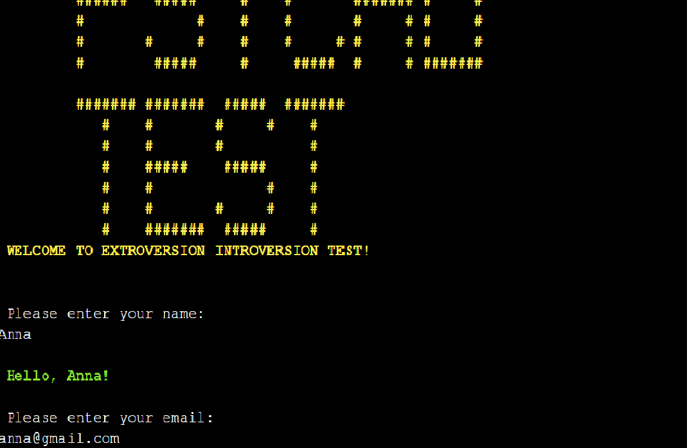
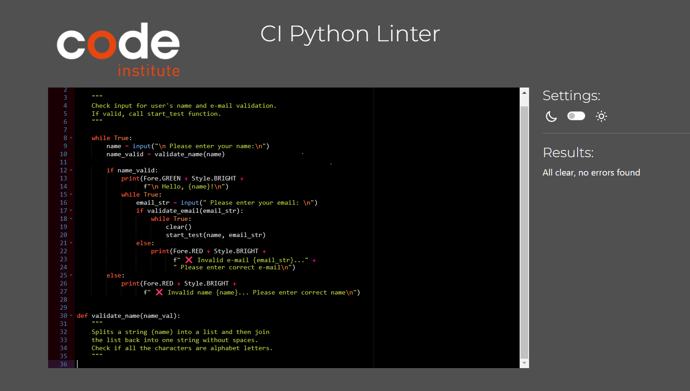

# Extroversion Introversion Test

### [Live site](https://extro-intro-test.herokuapp.com/)

## Contents:

- <a href="#introduction">Introduction</a>
- <a href="#flow">Flowchart</a>
- <a href="#experience">User Experience Design</a>
    - <a href="#first_time_user">First Time User</a>
    - <a href="#returning_user">Returning User</a>
- <a href="#features">Features</a>
    - <a href="#message">Introductory Message</a>
    - <a href="#validation">Data Validation</a>
    - <a href="#passing">Passing the Test</a>
    - <a href="#result">Test Result</a>
    - <a href="#colours">Colours</a>
- <a href="#model">Data Model</a>
    - <a href="#database">Writing to Database</a>
    - <a href="#class1">Questions_Answers Class</a>
    - <a href="#class2">User Class</a>
- <a href="#technologies">Technologies Used</a>
- <a href="#testing">Testing</a>
    - <a href="#validation">PEP8 Validation</a>
    - <a href="#manual_testing">Manual Testing</a>
    - <a href="#bugs">Bugs</a>
- <a href="#deployment">Deployment</a>
- <a href="#credits">Credits</a>

## 
Introduction

The Extroversion-Introversion test is a psychological assessment tool designed to measure an individual's personality traits related to extroversion and introversion. Extroversion and introversion are fundamental dimensions of personality proposed by Swiss psychologist Carl Jung.

Extroversion refers to a person's tendency to seek external stimulation and derive energy from social interactions. Extroverts are often outgoing, assertive, and enjoy being around people. They tend to be talkative, energetic, and may exhibit a preference for engaging in activities involving others.

Introversion, on the other hand, reflects a preference for internal reflection and solitude. Introverts tend to be more reserved, thoughtful, and prefer quiet environments. They may feel drained by excessive social interactions and require alone time to recharge their energy.

Ambiversion refers to a psychological concept that describes individuals who exhibit a balance between extroversion and introversion. An ambivert is someone who does not strongly lean towards either extreme of the extroversion-introversion spectrum but rather falls somewhere in the middle.

Unlike strict extroverts or introverts who lean heavily towards one end of the spectrum, ambiverts can adapt their behavior and energy levels to different social settings. They may enjoy and feel energized by social interactions, but also value and seek out periods of solitude and reflection.

This very simple test will allow the user to check whether he is an extrovert, an introvert or, like most people, an ambivert.

## 
Flowchart

The below flowchart shows the order in which actions are taken and how the program works.

## 
User Experience Design

### 
First Time User

- As a person who like likes to take tests, I would like some test with psychological questions but not too  long and difficult.
- As someone unfamiliar with the psychology, I would like something new and interesting  to pick up.
- As someone who is well-versed in psychology, I would like to compare this test with other tests I know to form my opinion.

### 
Returning User

- As a returning user, I would like to see my most recent result.
- I would like to be able to take the test again and compare the results.
- I wish the questions were different every time I take the test.

## 
Features

### 
Introductory Message

When the user runs the system, they will be greeted with a logo and a welcome message.

### 
Data Validation

The user is asked to enter their name and email. The data will only be classified as valid if the name contains at least 2 letters and the email address is in the correct format.

The data is validated, and it is checked whether the user exists in the database.
For the new user, a description of the test is displayed. For the returning user, the program shows the most recent result and asks if they want to take the test again.

### 
Passing the Test

There are 3 groups of questions in the database: general questions, specific questions to determine introversion, and specific questions to determine extroversion.
The test begins with a general group of questions.
For each answer in the direction of extroversion the user receives 1 point, in the direction of introversion the user receives -1 point.
If user reaches -4 or 4 points, the program switches to specific questions from the extroversion or introversion section, respectively. If the number of points goes back to the zone between -3 and 3, then the user returns to the list of basic questions. The test continues until the end of the list of questions.

### 
Test Result

The final result of the test is determined by the score: if the score is less than -3, then the result is an introverted user. If the score is greater than 3, then the result is the extrovert user. If the score is between -3 and 3, the user is ambivert.

### 
Colours

I wanted to achieve a bright, eye-catching look, stick to the color theme as much as possible, and not use too many colors.

 - Yellow - Used for banners, headers and for test questions.
 - Red - Used for warnings about incorrect input or program errors.
 - Green - Used to display basic test information and results.
 - White - Used for user inputs.

 In order to highlight some parts of the text, Style.BRIGHT attribute was used.

## 
Data Model

### 
Writing to Database

After the user passes the test, the username, email and test result are entered into the database. Google sheets were used to store the test questions, user's data and test results. The workbook consists of 4 tables: 'Test1', 'Test2', 'Test3' and 'Users'.

Each test table consists of questions and answer keys.

'Users' table consists of 3 columns: user's name, email and test result.

### 
Questions_Answers Class

- A Questions_Answers Class was created to contain the data of the test questions and the flag if the question has already been used.
- A Questions_Answers Class has the following attributes:
    - questions: list of questions
    - answers: list of answer keys
    - question_used: a flag that indicates whether the question has already been used in the test

### 
User Class

- A User Class was created to store the username, email, and flag for the returning user.
- A User Class has the following attributes:
    - name: username
    - emails: user email
    - exists: a flag indicating if the user has already passed the test

## 
Technologies Used

- The application was developed with Python
    - Python Packages:
        - [Colorama](https://pypi.org/project/colorama/) to print colored terminal text
        - Platform module and OS Module to check the system/OS name and interact with the underlying operating system
- [Heroku](https://www.heroku.com/platform) was used for deployment
- [Flowchart Maker and Online Diagram Software](https://app.diagrams.net/) was used to generate the flowchart
- [VS Code](https://code.visualstudio.com/) was used for development

## 
Testing

### 
Manual Testing

|  Testing |  Result |
|---|---|
| Testing all instances where user input is required. Entering valid and invalid data. | Invalid input is handled correctly. An error message is displayed. The user is prompted to try again. |
| Application navigation. Checking that the correct actions are being taken according to user input. | Navigation works as expected. Invalid inputs are handled.
| Check switching between lists of test questions. | Switching occurs correctly when the user reaches -4 or 4 points. If the score goes back to zone from -3 to 3, the program goes back to questions from the base list.
| Correct scoring. | Counting occurs in accordance with the key to the answers (+1 for a question towards extraversion, -1 for a question towards introversion). The final result is calculated correctly.
| Calculation and display of the test result. | The test result (extroversion, introversion or ambiversion) is calculated and displayed as expected.
| Writing user data and test result to the database table. | The user's name, e-mail and the final number of points are recorded correctly, in the first empty row and in the corresponding columns of the table. |
| Reading data of returning user. | Right checking if the name and email address of the returning user is in the database. The most recent test result is displayed as expected.

### 
PEP8 Validation

The code for run.py was passed through a [PEP8 validator](https://pep8ci.herokuapp.com/) with no issues present.

### 
Bugs

|  Issue |  Solution |
|---|---|
| User data was written to the data table incorrectly. | Edit the insert_user_data function to find the last empty row and insert data into it. Add the user_found flag to check if the user exists and overwrite the test result. If not, insert the new user's data into the table.  |
| Bug in the function that selects the question category. | Add question_used flag to check if the question was already used and set it's default value to 0. Change the flag value to 1 for used questions. |
|Function to clear terminal window did not work for Linux OS. |Import libraries to check OS and edit function clear() depending on the OS.

## 
Deployment

Cloning the Repository

    1. Click on the "Code" button near the top right corner of the page.
    2. Copy the URL that appears in the box. Open your terminal and navigate
       to the directory where you want to clone the repository.
    3. Type "git clone" and then paste the URL you copied in step 2.
    4. Press enter to run the command. This will clone the repository onto your local machine.
    5. You should now have a local copy of the GitHub repository on your machine.

Heroku Deployment Steps

    1. Make sure all dependencies are listed in your requirements.txt file.
       To do this, type in your python terminal pip3 freeze > requirements.txt.
    2. Now all your requirements will be added to the requirements file.
    3. Go to the Heroku website and navigate to the sign up button in the top right-hand corner.
    4. Next, click "New" in the top right-hand corner and select "Create new app".
    5. Then choose an app name. It must be unique.
    6. Then select "Europe" as your region.
    7. Click "Create app".
    8. Navigate to the "Settings" tab.
    9. Click on "Config Vars".
    10. For the first "KEY", input "CREDS".
    11. For "VALUE", input your entire creds.json file including the curly braces. Click "Add".
    12. For the second "KEY", input "PORT".
    13. For the second "PORT", input "8000". Click "Add".
    14. Scroll down to Buildpacks and select "Add buildpack".
    15. Select Python first and then add another buildpack and select Node JS.
        Python must be listed above Node JS for this to work.
    16. Scroll back to the top and select the "Deploy" tab.
    17. From Deployment method, select "GitHub".
    18. Now search for your GitHub repository name and select the correct repository.
    19. Now scroll down to Automatic deploys and choose the "main" branch.
        Therefore, any changes that have been pushed through to GitHub will update the Heroku app.
    20. Then scroll down to Manual deploy and click "Deploy Branch".
    21. When complete, click on "View", which will open a new tab and display your program.

## 
Credits

Code Institute [repository template](https://github.com/Code-Institute-Org/python-essentials-template) used for deployment.
